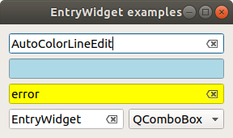

# entryWidget
Data entry PyQt5 QWidget subclasses, for error checking with automatic colors.

## Classes:
    
    AutoColorLineEdit  # QLineEdit with automatic colors
    LabelLineEdit  # AutoColorLineEdit with a QLabel on left side
    EntryWidget  # LabelLineEdit with QComboBox on right side
    ButtonLineEdit  # LabelLineEdit with QPushButton instead of QLabel
    ButtonEntryWidget  # EntryWidget with QPushButton instead of QLabel
    

## Installation

    git clone https://github.com/timjolson/entrywidget.git
    pip3 install entrywidget  # (use -e to edit/develop)
    sudo python3 -m entrywidget  # copy QtDesigner plugin file for system-wide use

## doc strings:

#### AutoColorLineEdit
    A QLineEdit (in a QHBoxLayout) with error checking options with automatic color updates.
    QLineEdit (.lineEdit):
        Change with obj.setText('new text')
        Read with obj.text()

    methods:
        getError()  # get widget's error status
        setError(any)  # set widget's error status (updates colors, emits relevant signals)
        clearError()  # set widget's error status to None (updates colors, emits relevant signals)

    signals:
        hasError(error status)  # emitted when bool(error status) is True
        errorChanged(error status)  # emitted when error status changes
        errorCleared  # emitted when bool(error status) is changed to False
        editingFinished  # emitted when Enter/Return pressed or focus is changed out of QLineEdit
        textChanged(text)  # emitted when text changes at all
        textEdited(text)  # emitted when text is changed by user

    All arguments are optional and must be provided by keyword, except 'parent' which can be positional.
    :param parent: Parent Qt Object (default None for individual widget)
    :param objectName: str, name of object for logging and within Qt
    :param text: str, starting text
    :param autoColors: dict of tuples of color strings; see help(setAutoColor) for formatting
    :param readOnly: bool, whether the text box is editable
    :param liveErrorChecking: bool, whether error checking occurs
                after every keystroke (=True) or only after text editing is finished (=False)

        
#### LabelLineEdit
    A QLabel next to an AutoColorLineEdit.
    QLabel (.label):
        Change with obj.setLabel('new text')
        Read with obj.getLabel()

    All arguments are optional and must be provided by keyword, except 'parent' which can be positional.
    kwargs listed here will be passed to constructors of QLineEdit/QLabel

    Widget kwargs
    :param parent: Parent Qt Object (default None for individual widget)
    :param objectName: str, name of object for logging and within Qt
    :param readOnly: bool, whether the text box is editable

    QLineEdit kwargs
    :param text: str, starting text
    :param autoColors: dict of tuples of color strings; see help(setAutoColor) for formatting
    :param liveErrorChecking: bool, whether error checking occurs
                after every keystroke (=True) or only after text editing is finished (=False)

    QLabel kwargs
    :param label: str, label text
        
#### EntryWidget
    A DictComboBox after a LabelLineEdit.
    DictComboBox (.comboBox):
        Set options with obj.setOptions(['opt1', 'opt2', 'op3'])
        Get options with obj.getOptions()
        Set selected with obj.setSelected('opt2')
        Get selected with obj.getSelected()
        Set/unset ReadOnly with obj.setOptionFixed(bool)

    signals:
        optionChanged(text)  # emits newly selected option when selection is changed
        optionIndexChanged(int)  # emits new selection index when changed

    All arguments are optional and must be provided by keyword, except 'parent' which can be positional.
    kwargs listed here will be passed to constructors of QLineEdit/QLabel/DictComboBox

    Widget kwargs
    :param parent: Parent Qt Object (default None for individual widget)
    :param objectName: str, name of object for logging and within Qt
    :param readOnly: bool, whether the text box is editable

    QLineEdit kwargs
    :param text: str, starting text
    :param autoColors: dict of tuples of color strings; see help(setAutoColor) for formatting
    :param liveErrorChecking: bool, whether error checking occurs
                after every keystroke (=True) or only after text editing is finished (=False)

    QLabel kwargs
    :param label: str, label text

    DictComboBox kwargs
    :param options: [str, str, ...]
    :param optionFixed: bool, whether option is fixed or can be changed

